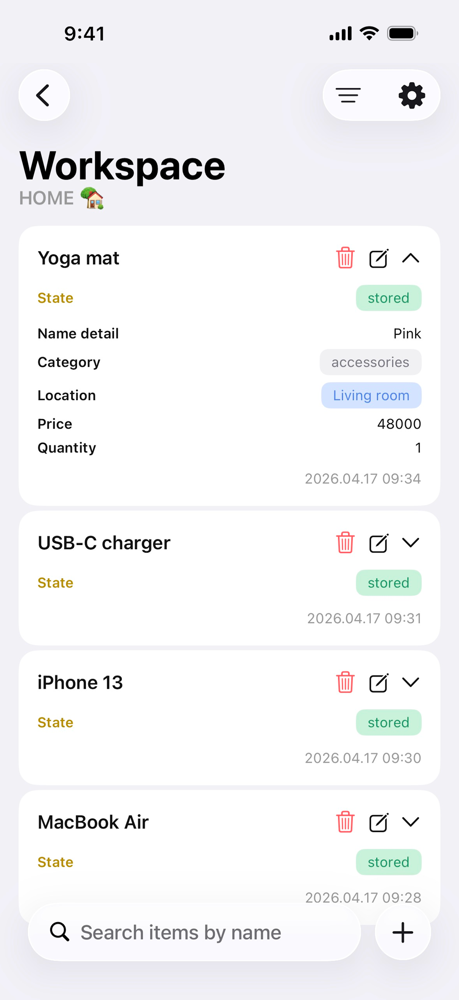
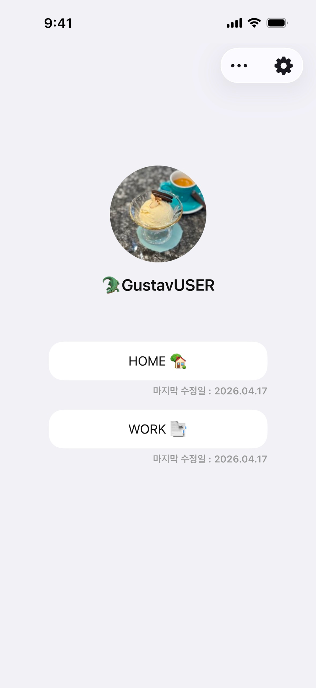
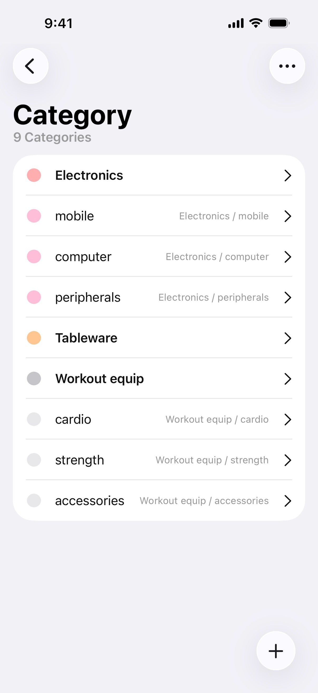
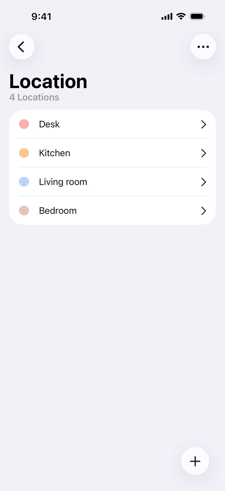
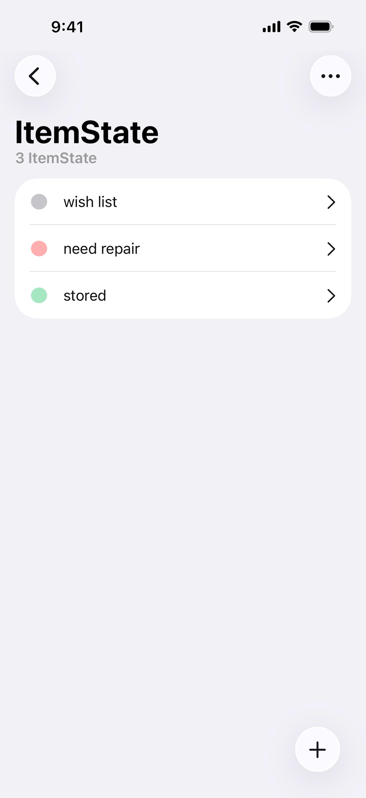
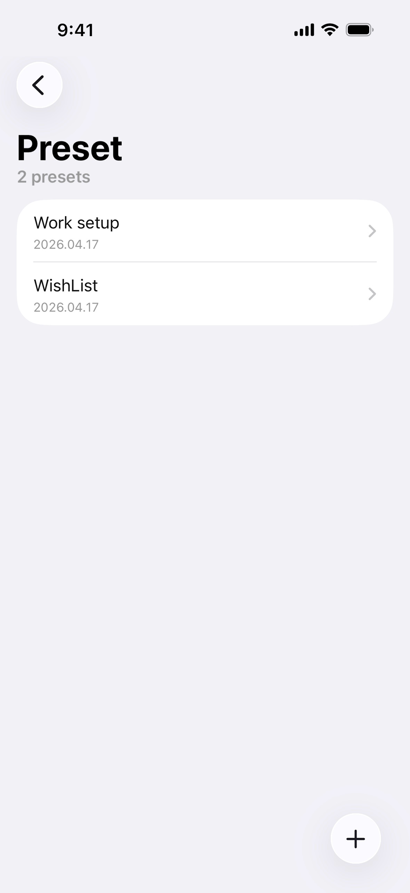
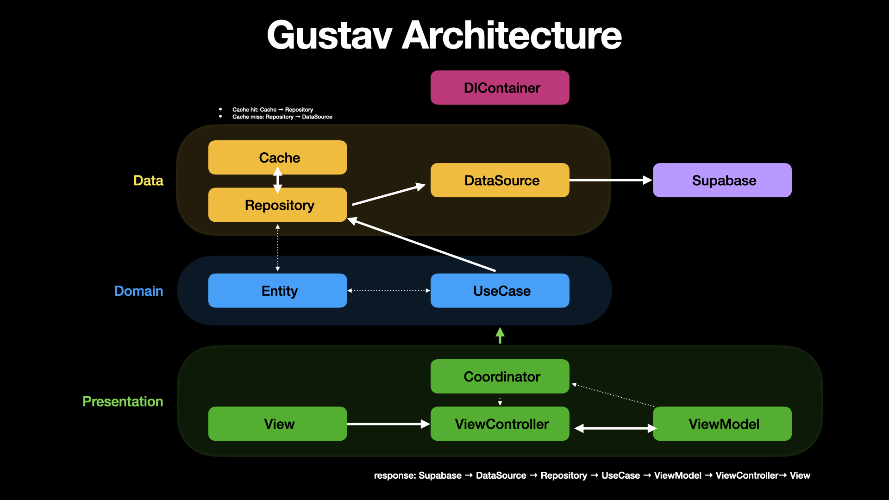

<p align="left">
  
</p>

## Gustav - Good Stuff

> App Store: https://apps.apple.com/kr/

## 소개

**Gustav**는 워크스페이스 기반으로 물건을 체계적으로 정리하고, 쉽게 찾을 수 있도록 도와주는 개인 물건 관리 iOS 앱입니다.

## 주요 기능

| 기능 | 설명 |
| --- | --- |
| **워크스페이스** | 여러 워크스페이스를 활용해 물건을 체계적으로 관리 |
| **아이템 목록** | 각 물건의 정보를 쉽고 편리하게 기록 및 관리 |
| **태그 (카테고리 / 장소 / 상태)** | 세 가지 태그를 통해 물건을 직관적으로 분류 |
| **정렬 / 필터 / 검색** | 다양한 조건과 키워드를 활용해 원하는 아이템을 빠르게 검색 |
| **프리셋** | 자주 사용하는 정렬, 필터, 검색 조건을 저장하고 한 번에 적용 |

## 스크린샷

<p align="center">
  
  
  
</p>

<p align="center">
  
  
  
</p>

## 담당 기능

| 팀원 | 식별코드 | 담당 기능 |
| --- | --- | --- |
| **Kevin(Kevin)** | K | 앱 설정, 웹 뷰, 프로필, 아이템 목록, 정렬 / 필터 / 검색 |
| **eunnim1472(Song)** | S | 소셜 및 이메일 로그인 / 회원 가입, 아이템 추가 / 수정, 프리셋 |
| **PSL0313(Parkthro)** | P | 워크스페이스, 카테고리 / 장소 / 상태 |

## 기술 스택

### iOS

- **Swift 5** + **UIKit(Code Base)**
- **iOS 17.0+**

### Supabase

- **Authentication** - 이메일 / 애플 로그인 사용자 인증
- **Database** - 실시간 데이터베이스
- **Storage** - 이미지 저장
- **Edge Functions** - 애플 로그인

### 라이브러리

- **Kingfisher** - 이미지 다운로드 및 캐싱
- **SnapKit** - Auto Layout을 코드로 간결하게 작성

## 아키텍처

<p align="center">
  
</p>

## 아키텍처 패턴

- **MVVM-C** - ViewModel을 활용하여 View와 비즈니스 로직을 분리하고, Coordinator를 활용하여 화면 전환 책임을 분리
- **Clean Architecture** - Domain, Data, Presentation 계층으로 분리하고, 의존성 역전을 통해 테스트 용이성과 확장성을 확보

## 프로젝트 구조

```
Gustav/
├── App/
│   ├── DIContainer/            # 앱 의존성 관리
│   └── NotificationCenter/     # 앱 전역 이벤트 관리
├── Domain/
│   ├── Entity/                 # 앱 핵심 비즈니스 로직
│   ├── Error/                  # 도메인 계층 에러 정의
│   │
│   ├── Aggregate/              # Entity 통합 데이터 타입
│   ├── Convenience/            # 편의성을 위한 데이터 타입
│   │
│   ├── Usecase/                # 앱 유즈케이스 정의
│   └── RepositoryProtocol/     # Data Layer Repository Protocol (테스트 용이성)
├── Data/
│   ├── DTO/                    # Data Transfer Object
│   ├── Error/                  # 데이터 계층 에러 정의
│   │
│   ├── DataSourceProtocol/     # DataSource Protocol (테스트 용이성)
│   ├── DataSource/             # Repository에 주입하는 데이터 소스 구현체 (외부 + 캐시)
│   │
│   └── Repository/             # 외부 및 캐시로부터의 데이터를 저장해두는 저장소
└── Presentation/
    ├── View/                   # Code base Custom View 작성
    ├── ViewController/         # UI Event와 ViewModel 비즈니스 로직 연결
    ├── ViewModel/              # Input / Output / 화면 전환 전달(Coordinator) 구조로 비즈니스 로직 처리
    │
    ├── Coordinator/            # 화면 전환 기능 구현
    └── Convenience/            # 아이콘, 색상, 글꼴 등 앱 전역 상수 정의
```

## 브랜치 전략

| 브랜치 | 용도 |
| --- | --- |
| `main` | 안정적으로 동작하는 코드 보관 |
| `develop` | 각 계층 구현 코드 취합 |
| `feature/계층 이름` | 클린 아키텍처 계층별 개발 (예: `domain`, `data`, `presentation`) |

## 커밋 메세지 규칙

```
[식별코드] [작업종류]: 작업 내용

예시:
P062 Fix: 버그 수정
S088 Features: 투표 기능 추가
K003 Refactor: 코드 리팩토링
```

```
Made with ❤️ by teamgoob
